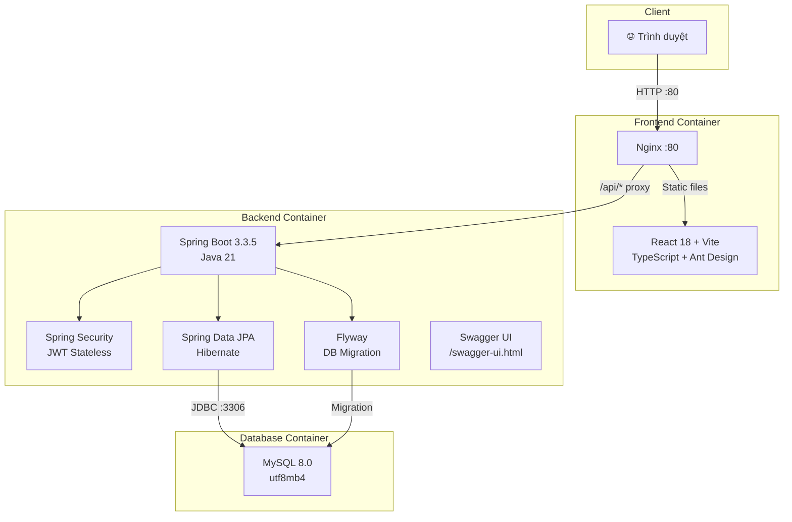
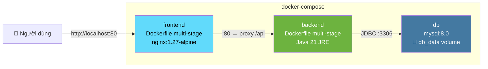
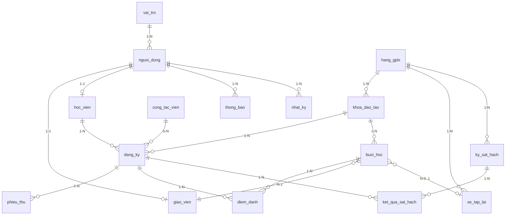
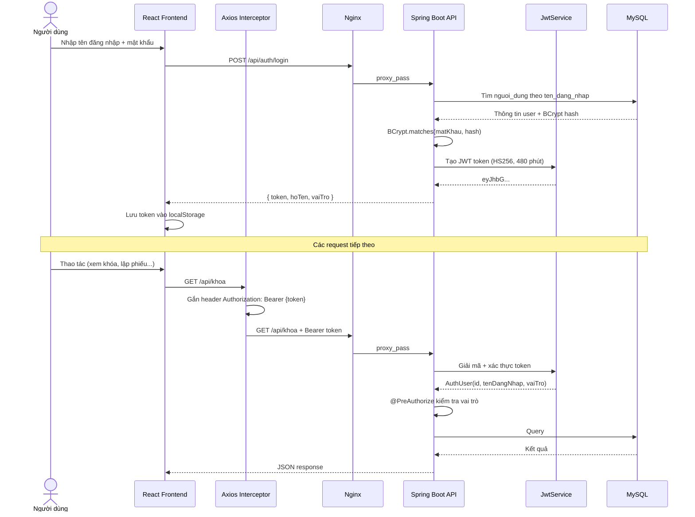
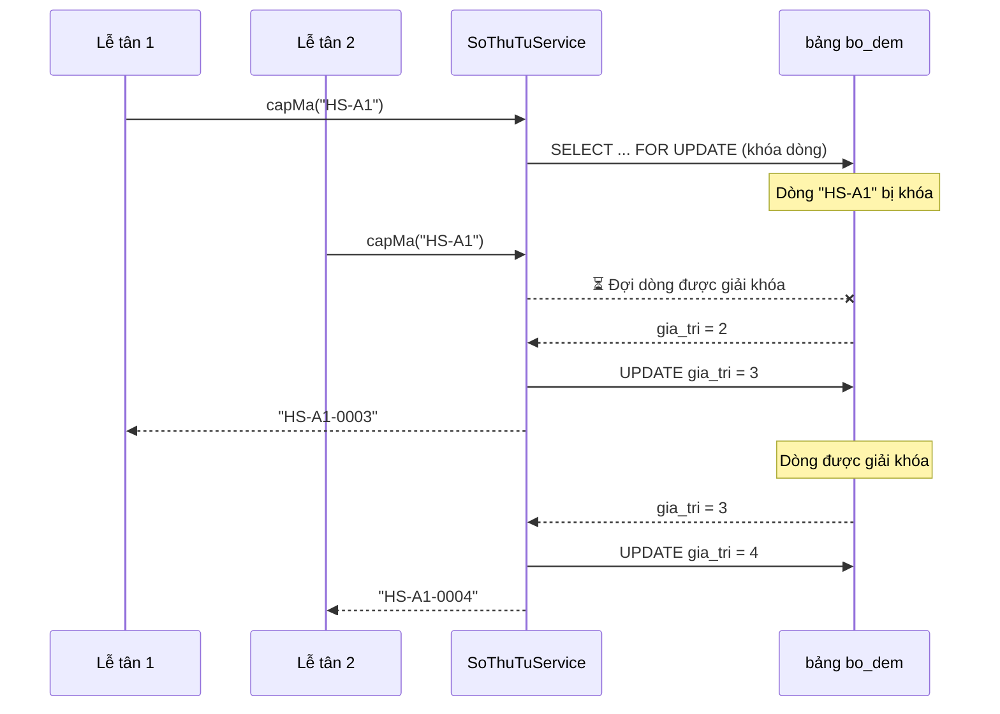

# 📘 THỰC HÀNH TRIỂN KHAI DỰ ÁN DTMS VẠN XUÂN

## Hệ thống quản lý Trung tâm đào tạo lái xe Vạn Xuân
**Đồ án thực tập tốt nghiệp** – Nguyễn Thanh Tùng (K23DTCN405) – Khoa CNTT, PTIT

---

## 📋 Mục lục

1. [Tổng quan kiến trúc](#1-tổng-quan-kiến-trúc)
2. [Yêu cầu môi trường](#2-yêu-cầu-môi-trường)
3. [Phần A – Chạy khi phát triển (Dev Mode)](#phần-a--chạy-khi-phát-triển)
4. [Phần B – Triển khai bằng Docker](#phần-b--triển-khai-bằng-docker)
5. [Phần C – Kiểm thử API](#phần-c--kiểm-thử-api)
6. [Phần D – Phân tích mã nguồn](#phần-d--phân-tích-mã-nguồn)
7. [Phần E – Bài tập tự làm thêm](#phần-e--bài-tập-tự-làm-thêm)

---

## 1. Tổng quan kiến trúc



### Stack công nghệ

| Tầng | Công nghệ | Phiên bản | Vai trò |
|------|-----------|-----------|---------|
| **Frontend** | React + TypeScript | 18.3.1 | Giao diện người dùng SPA |
| | Ant Design | 5.29.3 | UI Component Library |
| | Vite | 5.4.10 | Build tool & Dev server |
| | React Query | 5.x | Data fetching & caching |
| | Recharts | 3.x | Biểu đồ Dashboard |
| **Backend** | Spring Boot | 3.3.5 | REST API Framework |
| | Java | 21 (LTS) | Ngôn ngữ lập trình |
| | Spring Security + JWT | jjwt 0.12.6 | Xác thực & phân quyền |
| | Flyway | (managed) | Quản lý phiên bản CSDL |
| | OpenPDF | 1.3.43 | Xuất phiếu thu PDF tiếng Việt |
| | Apache POI | 5.3.0 | Xuất Excel |
| | Springdoc OpenAPI | 2.6.0 | Tài liệu API (Swagger) |
| **CSDL** | MySQL | 8.0 | Cơ sở dữ liệu quan hệ |
| **Triển khai** | Docker Compose | 3 services | Container hóa toàn bộ |
| | Nginx | 1.27 | Reverse proxy & static files |

### Cấu trúc thư mục dự án

```
dtms-vanxuan/
├── .env.example              # Template biến môi trường
├── .gitignore
├── docker-compose.yml        # Orchestrate 3 containers
├── api-test.http             # Test API (IntelliJ / VS Code)
├── README.md
│
├── backend/                  # ── Spring Boot (Maven) ──
│   ├── Dockerfile            # Multi-stage: build JAR → chạy JRE
│   ├── pom.xml
│   └── src/main/
│       ├── java/vn/vanxuan/dtms/
│       │   ├── DtmsApplication.java       # @SpringBootApplication
│       │   ├── common/                    # ApiError, BoDem, NhatKy, SoThanhChu...
│       │   ├── config/                    # OpenApiConfig (Swagger)
│       │   ├── security/                  # JWT, SecurityConfig, AuthUser
│       │   └── module/
│       │       ├── auth/                  # AuthController (login)
│       │       ├── nguoidung/             # NguoiDung entity, VaiTro
│       │       ├── danhmuc/               # HangGplx, GiaoVien, XeTapLai, CTV
│       │       ├── khoa/                  # KhoaDaoTao, XetHoanThanh
│       │       ├── hocvien/               # HocVien, DangKy, PublicController
│       │       ├── lichhoc/               # BuoiHoc, DiemDanh, TienDo
│       │       ├── hocphi/                # PhieuThu, CongNo, PDF
│       │       └── baocao/                # BaoCaoController (Dashboard)
│       └── resources/
│           ├── application.yml            # Cấu hình Spring Boot
│           ├── db/migration/
│           │   ├── V1__init.sql           # 15 bảng + 3 view
│           │   ├── V2__seed.sql           # Dữ liệu mẫu
│           │   ├── V3__bo_dem.sql         # Bộ đếm số tự tăng
│           │   └── V4__hocvien_login.sql  # Khởi tạo tài khoản học viên mẫu
│           └── fonts/                     # DejaVu (PDF tiếng Việt)
│
└── frontend/                 # ── React 18 + Vite ──
    ├── Dockerfile            # Multi-stage: build → Nginx
    ├── nginx.conf            # Proxy /api → backend
    ├── package.json
    ├── vite.config.ts        # Dev proxy /api → localhost:8080
    └── src/
        ├── main.tsx          # Bootstrap: AntD, React Query, Router
        ├── App.tsx           # Routes + phân quyền theo vai trò
        ├── api/
        │   ├── client.ts     # Axios instance + JWT interceptor
        │   ├── types.ts      # TypeScript interfaces ↔ backend DTO
        │   └── hooks.ts      # React Query custom hooks
        ├── auth/
        │   ├── AuthContext.tsx  # Context xác thực
        │   └── RequireRole.tsx  # Guard route theo vai trò
        ├── components/
        │   ├── AppLayout.tsx    # Layout Sider + Header
        │   └── SoTienInput.tsx  # Input format tiền VNĐ
        └── pages/
            ├── LoginPage.tsx
            ├── DashboardPage.tsx
            ├── TongQuanGiaoVienPage.tsx
            ├── HocTapPage.tsx
            ├── KhoaPage.tsx
            ├── HocVienPage.tsx
            ├── LichHocPage.tsx
            ├── DiemDanhPage.tsx
            ├── CongNoPage.tsx
            └── PublicDangKyPage.tsx
```

---

## 2. Yêu cầu môi trường

### Cách 1: Chạy Dev (không Docker)

| Phần mềm | Phiên bản tối thiểu | Kiểm tra |
|-----------|---------------------|----------|
| **JDK** | 21+ | `java -version` |
| **Maven** | 3.9+ (hoặc dùng IntelliJ) | `mvn -version` |
| **Node.js** | 18+ (khuyến nghị 20) | `node -v` |
| **npm** | 9+ | `npm -v` |
| **MySQL** | 8.0 | `mysql --version` |

### Cách 2: Triển khai Docker (khuyến nghị)

| Phần mềm | Kiểm tra |
|-----------|----------|
| **Docker Desktop** (Windows/Mac) hoặc **Docker Engine** (Linux) | `docker --version` |
| **Docker Compose** (đi kèm Docker Desktop) | `docker compose version` |

---

## Phần A – Chạy khi phát triển

### Bước A1: Cài đặt MySQL 8 trên máy local

> [!TIP]
> Nếu đã có Docker, có thể chạy MySQL bằng Docker thay vì cài đặt:
> ```powershell
> docker run -d --name mysql-dtms -p 3306:3306 -e MYSQL_ROOT_PASSWORD=123456 -e MYSQL_DATABASE=vanxuan_dtms mysql:8.0 --character-set-server=utf8mb4 --collation-server=utf8mb4_unicode_ci
> ```

Nếu cài trực tiếp:
1. Tải MySQL 8.0 từ https://dev.mysql.com/downloads/
2. Trong quá trình cài, đặt mật khẩu root là `123456` (khớp với [application.yml](file:///c:/Users/Thinkpad%20P15V3/Desktop/Tùng/Đại%20học/Thực%20tập%20tốt%20nghiệp/thực%20hành%20tốt%20nghiệp/dtms-vanxuan-source/dtms-vanxuan/backend/src/main/resources/application.yml))
3. CSDL `vanxuan_dtms` sẽ được **tự động tạo** nhờ tham số `createDatabaseIfNotExist=true` trong connection string

### Bước A2: Chạy Backend (Spring Boot)

```powershell
# Di chuyển đến thư mục backend
cd "c:\Users\Thinkpad P15V3\Desktop\Tùng\Đại học\Thực tập tốt nghiệp\thực hành tốt nghiệp\dtms-vanxuan-source\dtms-vanxuan\backend"

# Cách 1: Dùng Maven wrapper (nếu có) hoặc Maven
mvn spring-boot:run

# Cách 2: Mở bằng IntelliJ IDEA → chạy DtmsApplication.java
```

> [!IMPORTANT]
> Khi khởi động lần đầu, **Flyway** tự động chạy 3 file migration:
> - [V1__init.sql](file:///c:/Users/Thinkpad%20P15V3/Desktop/Tùng/Đại%20học/Thực%20tập%20tốt%20nghiệp/thực%20hành%20tốt%20nghiệp/dtms-vanxuan-source/dtms-vanxuan/backend/src/main/resources/db/migration/V1__init.sql) → Tạo **15 bảng** + **3 view** (v_cong_no, v_tien_do, v_doanh_thu_thang)
> - [V2__seed.sql](file:///c:/Users/Thinkpad%20P15V3/Desktop/Tùng/Đại%20học/Thực%20tập%20tốt%20nghiệp/thực%20hành%20tốt%20nghiệp/dtms-vanxuan-source/dtms-vanxuan/backend/src/main/resources/db/migration/V2__seed.sql) → Dữ liệu mẫu (tài khoản, khóa, học viên…)
> - [V3__bo_dem.sql](file:///c:/Users/Thinkpad%20P15V3/Desktop/Tùng/Đại%20học/Thực%20tập%20tốt%20nghiệp/thực%20hành%20tốt%20nghiệp/dtms-vanxuan-source/dtms-vanxuan/backend/src/main/resources/db/migration/V3__bo_dem.sql) → Bảng bộ đếm cho mã tự tăng
> - [V4__hocvien_login.sql](file:///c:/Users/Thinkpad%20P15V3/Desktop/Tùng/Đại%20học/Thực%20tập%20tốt%20nghiệp/thực%20hành%20tốt%20nghiệp/dtms-vanxuan-source/dtms-vanxuan/backend/src/main/resources/db/migration/V4__hocvien_login.sql) → Tạo tài khoản cho Học viên mẫu

Sau khi chạy thành công:
- API: http://localhost:8080
- Swagger UI: http://localhost:8080/swagger-ui.html

### Bước A3: Chạy Frontend (React + Vite)

```powershell
# Di chuyển đến thư mục frontend
cd "c:\Users\Thinkpad P15V3\Desktop\Tùng\Đại học\Thực tập tốt nghiệp\thực hành tốt nghiệp\dtms-vanxuan-source\dtms-vanxuan\frontend"

# Cài dependencies
npm install

# Chạy dev server
npm run dev
```

Mở trình duyệt tại **http://localhost:5173**

> [!NOTE]
> Trong chế độ dev, Vite proxy tất cả request `/api/*` sang `http://localhost:8080` (xem [vite.config.ts](file:///c:/Users/Thinkpad%20P15V3/Desktop/Tùng/Đại%20học/Thực%20tập%20tốt%20nghiệp/thực%20hành%20tốt%20nghiệp/dtms-vanxuan-source/dtms-vanxuan/frontend/vite.config.ts)), nên **không cần cấu hình CORS**.

### Bước A4: Đăng nhập thử

| Tên đăng nhập | Mật khẩu | Vai trò | Trang mặc định |
|---------------|----------|---------|-----------------|
| `admin` | `123456` | Quản trị viên | `/tong-quan` (Dashboard) |
| `letan01` | `123456` | Lễ tân / Tuyển sinh | `/hoc-vien` |
| `gv01` | `123456` | Giáo viên | `/tong-quan-gv` |
| `025205000001` | `123456` | Học viên | `/hoc-tap` |

---

## Phần B – Triển khai bằng Docker

### Sơ đồ Docker Compose (3 services)



### Bước B1: Tạo file `.env`

```powershell
cd "c:\Users\Thinkpad P15V3\Desktop\Tùng\Đại học\Thực tập tốt nghiệp\thực hành tốt nghiệp\dtms-vanxuan-source\dtms-vanxuan"

# Sao chép template
copy .env.example .env
```

Mở file `.env` và **đổi giá trị**:

```env
DB_PASSWORD=MatKhau_Manh_2026!
JWT_SECRET=VanXuan-DTMS-Secret-Key-2026-PhuTho-PTIT-TungK23
```

> [!CAUTION]
> - `DB_PASSWORD`: **KHÔNG** dùng mật khẩu yếu khi triển khai thật
> - `JWT_SECRET`: **TỐI THIỂU 32 ký tự**, nếu không backend sẽ báo lỗi khởi động

### Bước B2: Build và khởi động

```powershell
# Build image + khởi động tất cả containers
docker compose up -d --build
```

> [!NOTE]
> Lần đầu build sẽ mất **5–10 phút** vì cần tải dependencies Maven và npm.
> Các lần sau sẽ nhanh hơn nhờ Docker cache.

### Bước B3: Theo dõi logs

```powershell
# Xem log toàn bộ
docker compose logs -f

# Xem log riêng từng service
docker compose logs -f backend
docker compose logs -f db
docker compose logs -f frontend
```

**Dấu hiệu thành công:**
- `db`: `ready for connections` 
- `backend`: `Started DtmsApplication in X seconds`
- `frontend`: nginx start log

### Bước B4: Truy cập

Mở trình duyệt tại **http://localhost** (cổng 80)

### Bước B5: Dừng / xóa

```powershell
# Dừng (giữ data)
docker compose down

# Dừng + xóa volume (mất dữ liệu CSDL)
docker compose down -v
```

### Giải thích chi tiết docker-compose.yml

Xem file: [docker-compose.yml](file:///c:/Users/Thinkpad%20P15V3/Desktop/Tùng/Đại%20học/Thực%20tập%20tốt%20nghiệp/thực%20hành%20tốt%20nghiệp/dtms-vanxuan-source/dtms-vanxuan/docker-compose.yml)

```yaml
services:
  db:                                    # ① MySQL 8.0
    image: mysql:8.0
    environment:
      MYSQL_ROOT_PASSWORD: ${DB_PASSWORD}  # ← đọc từ .env
      MYSQL_DATABASE: vanxuan_dtms         # ← tạo DB tự động
    command: ["--character-set-server=utf8mb4", ...]  # ← hỗ trợ tiếng Việt
    volumes:
      - db_data:/var/lib/mysql             # ← dữ liệu bền vững
    healthcheck: ...                       # ← backend đợi DB sẵn sàng

  backend:                               # ② Spring Boot
    build: ./backend                       # ← Dockerfile multi-stage
    depends_on:
      db: { condition: service_healthy }   # ← chỉ chạy khi DB healthy
    environment:
      DB_HOST: db                          # ← tên container = hostname
      JWT_SECRET: ${JWT_SECRET}            # ← đọc từ .env

  frontend:                              # ③ Nginx + React build
    build: ./frontend
    ports:
      - "80:80"                            # ← cổng duy nhất expose ra ngoài
```

### Giải thích Dockerfile Backend (Multi-stage build)

Xem file: [backend/Dockerfile](file:///c:/Users/Thinkpad%20P15V3/Desktop/Tùng/Đại%20học/Thực%20tập%20tốt%20nghiệp/thực%20hành%20tốt%20nghiệp/dtms-vanxuan-source/dtms-vanxuan/backend/Dockerfile)

```dockerfile
# Stage 1: BUILD — dùng Maven + JDK 21 đầy đủ để build JAR
FROM maven:3.9-eclipse-temurin-21 AS build
WORKDIR /app
COPY pom.xml .
RUN mvn dependency:go-offline        # ← cache dependencies riêng
COPY src ./src
RUN mvn package -DskipTests         # ← tạo file .jar

# Stage 2: RUN — chỉ cần JRE nhẹ, image nhỏ hơn (~300MB vs ~800MB)
FROM eclipse-temurin:21-jre
COPY --from=build /app/target/dtms-backend-*.jar app.jar
ENTRYPOINT ["java", "-jar", "/app/app.jar"]
```

### Giải thích Dockerfile Frontend (Multi-stage build)

Xem file: [frontend/Dockerfile](file:///c:/Users/Thinkpad%20P15V3/Desktop/Tùng/Đại%20học/Thực%20tập%20tốt%20nghiệp/thực%20hành%20tốt%20nghiệp/dtms-vanxuan-source/dtms-vanxuan/frontend/Dockerfile)

```dockerfile
# Stage 1: BUILD — Node.js build React thành file tĩnh
FROM node:20-alpine AS build
COPY package.json package-lock.json ./
RUN npm ci                           # ← cài đúng phiên bản từ lock file
COPY . .
RUN npm run build                    # ← tsc + vite build → thư mục dist/

# Stage 2: SERVE — Nginx phục vụ file tĩnh + proxy API
FROM nginx:1.27-alpine
COPY nginx.conf /etc/nginx/conf.d/default.conf
COPY --from=build /app/dist /usr/share/nginx/html
```

### Giải thích Nginx Configuration

Xem file: [nginx.conf](file:///c:/Users/Thinkpad%20P15V3/Desktop/Tùng/Đại%20học/Thực%20tập%20tốt%20nghiệp/thực%20hành%20tốt%20nghiệp/dtms-vanxuan-source/dtms-vanxuan/frontend/nginx.conf)

```
┌─────────────────────────────────────────────┐
│                 Nginx :80                   │
├────────────┬────────────────────────────────┤
│ /api/*     │ → proxy_pass http://backend:8080 │  ← Spring Boot API
│ /swagger*  │ → proxy_pass http://backend:8080 │  ← Swagger UI
│ /assets/*  │ → file tĩnh (cache 1 năm)       │  ← JS/CSS đã hash
│ /*         │ → try_files → index.html         │  ← React Router SPA
└────────────┴────────────────────────────────┘
```

---

## Phần C – Kiểm thử API

### C1: Dùng file api-test.http

File [api-test.http](file:///c:/Users/Thinkpad%20P15V3/Desktop/Tùng/Đại%20học/Thực%20tập%20tốt%20nghiệp/thực%20hành%20tốt%20nghiệp/dtms-vanxuan-source/dtms-vanxuan/api-test.http) có sẵn **11 request mẫu** có thể chạy trực tiếp bằng:
- **IntelliJ IDEA**: HTTP Client tích hợp sẵn
- **VS Code**: Extension "REST Client"

**Thứ tự chạy:**

| # | Endpoint | Mô tả | Kết quả mong đợi |
|---|----------|-------|-------------------|
| 1 | `POST /api/auth/login` | Đăng nhập lấy JWT token | 200 + `{ token, hoTen, vaiTro }` |
| 2 | `GET /api/khoa` | Danh sách khóa đào tạo | 200 + mảng khóa |
| 3 | `GET /api/hoc-vien/tra-cccd/025205000001` | Tra CCCD học viên có sẵn | 200 + thông tin học viên |
| 4 | `POST /api/dang-ky` | Tiếp nhận hồ sơ mới | 200 + hồ sơ đăng ký |
| 5 | `POST /api/dang-ky` (trẻ tuổi) | Kiểm tra quy tắc tuổi BR-02 | **422** `HV_CHUA_DU_TUOI` |
| 6 | `GET /api/dang-ky?q=Thử` | Tìm kiếm hồ sơ | 200 + kết quả phân trang |
| 7 | `POST /api/phieu-thu` | Lập phiếu thu học phí | 200 + phiếu thu mới |
| 8 | `GET /api/phieu-thu/1/pdf` | In phiếu thu PDF | File PDF tiếng Việt |
| 9 | `GET /api/cong-no?chiConNo=true` | Xem công nợ | 200 + danh sách còn nợ |
| 10 | `GET /api/khoa` (không token) | Test bảo mật | **401** `CHUA_DANG_NHAP` |
| 11 | `POST /api/public/dang-ky` | Đăng ký trực tuyến (công khai) | 200 + mã hồ sơ |

### C2: Kiểm thử Unit Test

```powershell
cd backend
mvn test
```

---

## Phần D – Phân tích mã nguồn

### D1: Mô hình CSDL (15 bảng chính + 3 view)



### D2: Luồng xác thực JWT



### D3: Phân quyền theo vai trò

| Chức năng | ADMIN | LỄ TÂN | GIÁO VIÊN | HỌC VIÊN |
|-----------|:-----:|:-------:|:---------:|:--------:|
| Dashboard tổng quan | ✅ | ❌ | ❌ | ❌ |
| Tổng quan giáo viên | ❌ | ❌ | ✅ | ❌ |
| Quá trình học tập | ❌ | ❌ | ❌ | ✅ |
| Quản lý khóa đào tạo | ✅ | ✅ | ❌ | ❌ |
| Tiếp nhận hồ sơ học viên | ✅ | ✅ | ❌ | ❌ |
| Lập lịch học | ✅ | ✅ | ❌ | ❌ |
| Điểm danh | ✅ | ❌ | ✅ | ❌ |
| Lập phiếu thu, công nợ | ✅ | ✅ | ❌ | ❌ |
| In phiếu thu PDF | ✅ | ✅ | ❌ | ❌ |

### D4: Các quy tắc nghiệp vụ quan trọng

Xem implementation tại [DangKyService.java](file:///c:/Users/Thinkpad%20P15V3/Desktop/Tùng/Đại%20học/Thực%20tập%20tốt%20nghiệp/thực%20hành%20tốt%20nghiệp/dtms-vanxuan-source/dtms-vanxuan/backend/src/main/java/vn/vanxuan/dtms/module/hocvien/DangKyService.java):

| Mã | Quy tắc | Nơi kiểm tra |
|----|---------|--------------|
| BR-01 | CCCD 12 số, duy nhất trong hệ thống | `ck_hv_cccd` (DB) + `findByCccd` |
| BR-02 | Đủ tuổi tối thiểu tại ngày dự kiến sát hạch | `kiemTraTuoi()` → 422 `HV_CHUA_DU_TUOI` |
| BR-04 | Sĩ số khóa không vượt giới hạn | `kiemTraSiSo()` → 422 `KHOA_DU_SI_SO` |
| BR-07 | Không hủy hồ sơ nếu đã đóng tiền | `huy()` → 422 `DA_DONG_TIEN` |
| BR-09 | Yêu cầu hết nợ khi xét hoàn thành | `XetHoanThanhService` |
| BR-11 | Chặn trùng lịch giáo viên, xe | `LichHocService` |

### D5: Cơ chế cấp mã tự tăng (Race-safe)



---

## Phần E – Bài tập tự làm thêm

Theo README dự án, các module sau có thể tự phát triển thêm:

### 1. Module Sát hạch
- Bảng `ky_sat_hach` và `ket_qua_sat_hach` đã có sẵn trong schema
- Cần tạo: Entity, Repository, Service, Controller, Frontend page

### 2. Quản lý người dùng
- CRUD người dùng (tạo, sửa, đổi mật khẩu, khóa/mở)
- Chỉ ADMIN được truy cập

### 3. Thông báo và nhắc nợ định kỳ
- Bảng `thong_bao` đã có sẵn
- Sử dụng `@Scheduled` (đã enable trong `DtmsApplication`)

### 4. Báo cáo gửi Sở
- Xuất Excel/PDF theo mẫu quy định

---

> [!IMPORTANT]
> **Tóm tắt các bước triển khai nhanh:**
> ```powershell
> # 1. Clone/mở dự án
> # 2. Tạo file .env
> copy .env.example .env
> # 3. Sửa DB_PASSWORD và JWT_SECRET trong .env
> # 4. Build + chạy
> docker compose up -d --build
> # 5. Đợi ~5-10 phút rồi mở http://localhost
> # 6. Đăng nhập: admin / 123456
> ```
